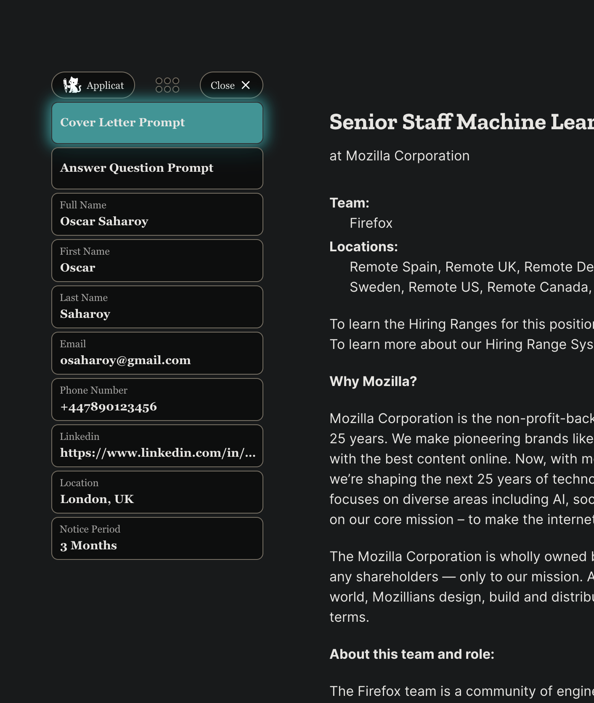

# Applicat

Applicat is a small browser extension that lets you setup quick answers to copy and paste into job application forms :) It also includes buttons to generate AI prompts for cover letters and application questions based on the webpage you are on.

